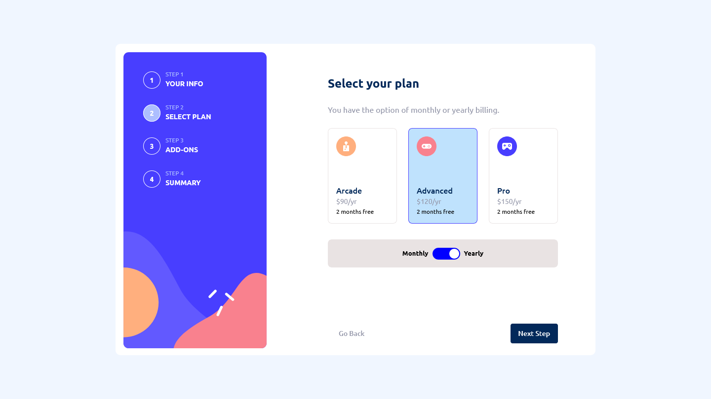

# Frontend Mentor - Multi-step form solution

This is a solution to the [Multi-step form challenge on Frontend Mentor](https://www.frontendmentor.io/challenges/multistep-form-YVAnSdqQBJ). Frontend Mentor challenges help you improve your coding skills by building realistic projects.

## Table of contents

- [Overview](#overview)
  - [The challenge](#the-challenge)
  - [Screenshots](#screenshots)
  - [Links](#links)
- [My process](#my-process)
  - [Built with](#built-with)
  - [What I learned](#what-i-learned)
  - [Continued development](#continued-development)
  - [Useful resources](#useful-resources)
- [Author](#author)

## Overview

### The challenge

Users should be able to:

- Complete each step of the sequence
- See a summary of their selections on the final step and confirm their order
- View the optimal layout for the interface depending on their device's screen size
- See hover and focus states for all interactive elements on the page

### Screenshots

### Links

- Solution URL: [Github](https://github.com/Emmanuel-Gumede/multi-step-form)
- Live Site URL: [Github Pages](https://your-live-site-url.com)

## My process

### Built with

- Semantic HTML5 markup
- CSS custom properties
- Flexbox
- CSS Grid
- Mobile-first workflow
- [React](https://reactjs.org/) - JS library
- SASS (SCSS)

### What I learned

In this project I learned a lot about HTML forms, especially designing and styling input elements such as checkboxes and radio buttons. I had a lot of fun manipulating the traditional look of these input elements, by adding images, titles and notes as well as resizing and positioning these on the form itself.

I also enjoyed doing this project with React. I learnt a lot of React tricks such as switching pages, re-using repeatitive components as well as handling props.

### Continued development

In this project, I realized that planning for a project like this is paramount important. I therefore intend to develop project planning skills in all my future projects. I am also a newbie with SASS and it is my goal to continue developing my knowledge and skill using this wonderfull CSS tool. Lastly, I am still focusing on learning React library.

### Useful resources

- [React JavaScript Library](https://reactjs.org/) - This is the official website for React library. I always have this website open in case I run into some issues while using this library.
- [SCSS CSS Extention](https://sass-lang.com/) - This is the official website for SCSS. The documentation section contains tons of useful examples.

## Author

- Frontend Mentor - [@Emmanuel-Gumede](https://www.frontendmentor.io/profile/Emmanuel-Gumede)
- Twitter - [@MisenDev](https://www.twitter.com/MisenDev)
